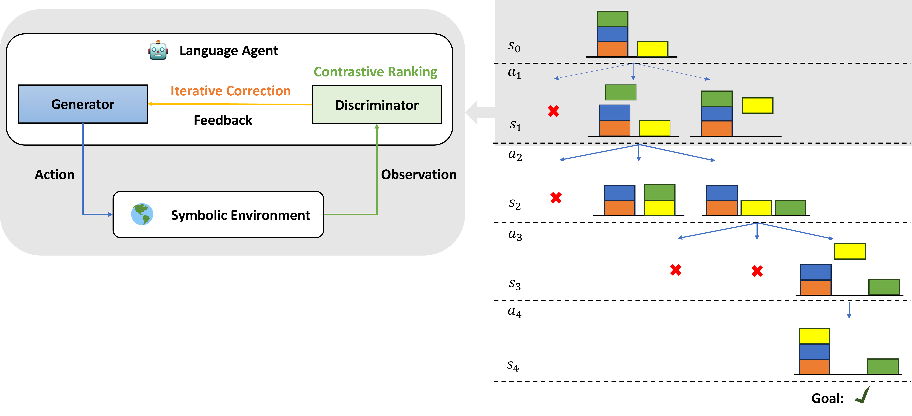

# Deliberate Planning in Language Models with Symbolic Representation

This repository contains the implementation of the paper [Deliberate Planning in Language Models with Symbolic Representation](https://openreview.net/pdf?id=uJHpaZlIvT).

**Key Results:**
| Model        | **Zero-shot CoT** | **Few-shot CoT (4-shot)** | **ToT (Tree of Thought)** | **RAP (Reasoning as Planning)** | **SymPlanner** |
| :----------- | :----------------: | :-----------------------: | :-----: | :-----: | :-------------: |
| **GPT-4o-mini** | 1.7 | 6.7 | 6.7 | 12.5 | **21.6** |
| **GPT-4o**      | 17.5 | 17.5 | 9.2 | 17.5 | **50.0** |
| **GPT-4.1**     | 0.8 | 25.0 | 10.8 | 24.2 | **54.2** |

## Introduction

**SymPlanner** extends our previous work [SWAP](https://github.com/xiongsiheng/SWAP) (**Structure-Aware Planning**). 
The framework incorporates a **symbolic world model** to improve the accuracy of state prediction during planning.

To enhance prompting-based planning methods, we introduce two additional mechanisms:
- **Iterative correction**, which increases the diversity of generated actions.
- **Contrastive ranking**, which improves the discrimination between candidate intermediate states.

Together, these components enable more reliable planning and reasoning in language models.

<br>
<p align="center">
  
</p>

## Quick Start

First download [PlanBench](https://github.com/karthikv792/LLMs-Planning)

**Installation**
```sh
git clone https://github.com/xiongsiheng/SymPlanner.git

cd SymPlanner

pip install -r Requirements.txt
```

### Inference
```sh
cd src

python main.py \
  --data ../dataset/blocksworld_sampled_split_v1 \
  --model gpt-4.1 \
  --output_dir ../results/test_blocksworld_gpt_4.1_sym \
  --max_steps 32 \
  --num_rollouts 32 \
  --num_generations 3 \
  --group_size 3 \
  --beam_width 3 \
  --cmp_per_opt 1 \
  --enable_symbolic \
  --iterative_correction \
  --contrastive_ranking \
  --visualize \
  --batch_process
```

**Arguments:**

`--data` (*str*): Path to the dataset for evaluation.

`--model` (*str, default=`gpt-4.1`*): Language model used for inference (e.g., `gpt-4o`, `gpt-4.1`, etc.).

`--output_dir` (*str*): Directory to save inference results.

`--visualize` (*flag*): If set, saves visualizations of the language model outputs.

`--batch_process` (*flag*): If set, enables batch processing for faster inference.

`--max_steps` (*int, default=20*): Maximum number of reasoning steps per problem.

`--num_rollouts` (*int, default=8*): Number of rollouts (trajectories) generated for each problem.

`--num_generations` (*int, default=5*): Number of generations per step for candidate actions.

`--cmp_per_opt` (*int, default=1*): Number of comparisons performed per option when ranking.

`--group_size` (*int, default=3*): Group size used for single-time comparison (recommended: 2 or 3).

`--beam_width` (*int, default=3*): Beam width for search during planning.

`--enable_symbolic` (*flag*): Enables symbolic reasoning with the world model for more accurate state prediction.

`--iterative_correction` (*flag*): Enables iterative correction to diversify action generation.

`--contrastive_ranking` (*flag*): Enables contrastive ranking to better discriminate between intermediate states.


### API
By default, the system uses the OpenAI API. 
Please add your own openAI API token as `openai_API_default` at the beginning of `utils.py`. 
Local models are not required unless explicitly configured, so no GPU is needed for basic usage.


### Citation

```bibtex
@inproceedings{xiongdeliberate,
  title={Deliberate Planning in Language Models with Symbolic Representation},
  author={Xiong, Siheng and Liu, Zhangding and Zhou, Jieyu and Su, Yusen},
  booktitle={Twelfth Annual Conference on Advances in Cognitive Systems}
}
```

```bibtex
@inproceedings{xiong-etal-2025-deliberate,
    title = "Deliberate Reasoning in Language Models as Structure-Aware Planning with an Accurate World Model",
    author = "Xiong, Siheng  and
      Payani, Ali  and
      Yang, Yuan  and
      Fekri, Faramarz",
    editor = "Che, Wanxiang  and
      Nabende, Joyce  and
      Shutova, Ekaterina  and
      Pilehvar, Mohammad Taher",
    booktitle = "Proceedings of the 63rd Annual Meeting of the Association for Computational Linguistics (Volume 1: Long Papers)",
    month = jul,
    year = "2025",
    address = "Vienna, Austria",
    publisher = "Association for Computational Linguistics",
    url = "https://aclanthology.org/2025.acl-long.1540/",
    doi = "10.18653/v1/2025.acl-long.1540",
    pages = "31900--31931",
    ISBN = "979-8-89176-251-0"
}
```
