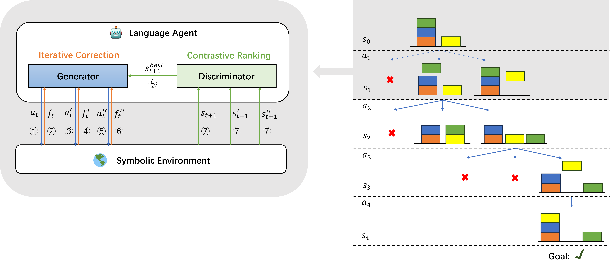

# Deliberate Planning in Language Models with Symbolic Representation

This repo contains the code for the paper [Deliberate Planning in Language Models with Symbolic Representation](https://arxiv.org/pdf/2505.01479).

| Model        | **Zero-shot CoT** | **Few-shot CoT (4-shot)** | **ToT** | **RAP** | **SymPlanner** |
| :----------- | :----------------: | :-----------------------: | :-----: | :-----: | :-------------: |
| **GPT-4o-mini** | 1.7 | 6.7 | 6.7 | 12.5 | **21.6** |
| **GPT-4o**      | 17.5 | 17.5 | 9.2 | 17.5 | **50.0** |
| **GPT-4.1**     | 0.8 | 25.0 | 10.8 | 24.2 | **54.2** |

## Introduction

SymPlanner a follow-up work of [SWAP](https://github.com/xiongsiheng/SWAP). We integrate a symbolic world model to enable more accurate state prediction. To enhance prompting-based methods, we introduce iterative correction to increase the diversity of action generation, and contrastive ranking to improve the discrimination of intermediate states.


<br>
<p align="center">
  
</p>

## Quick Start

Download [PlanBench](https://github.com/karthikv792/LLMs-Planning)

Preparation:
```sh
git clone https://github.com/xiongsiheng/SymPlanner.git

cd SymPlanner

pip install -r Requirements.txt
```


Inference:
```sh
cd src

python main.py  --data ../dataset/blocksworld_sampled_split_v1 --model gpt-4.1 --output_dir ../results/test_blocksworld_gpt_4.1_sym --max_steps 32 --num_rollouts 32  --num_generations 3 --group_size 3 --beam_width 3 --cmp_per_opt 1 --enable_symbolic --iterative_correction --contrastive_ranking --visualize --batch_process

```

### API:
By default, the system uses the OpenAI API. Please add your own openAI API token as `openai_API_default` at the beginning of `utils.py`. No local models are used unless explicitly configured (No GPU is needed).
